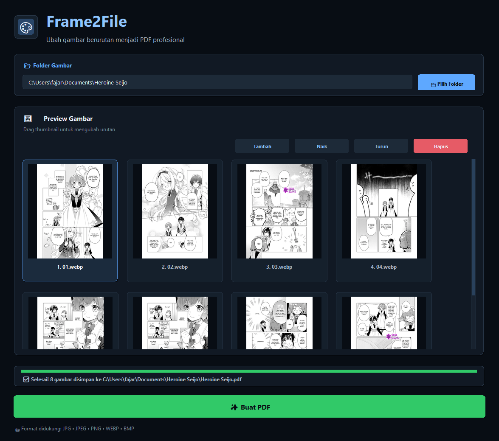

# Frame2File

Frame2File is a local Python desktop application for converting image files into a single PDF through a simple Tkinter GUI. It is designed for arranging image sequences, previewing them, and exporting them as a PDF file without using an online service.

## Screenshot



## Main Features

- Select a folder and automatically load supported image files.
- Add individual image files manually.
- Preview images as thumbnails before conversion.
- Reorder images by dragging thumbnails.
- Move the selected image up or down.
- Remove selected images from the conversion list.
- Convert images into one PDF file.
- Show conversion progress and status messages.
- Runs locally on your computer.

## Supported Image Formats

- JPG
- JPEG
- PNG
- WEBP
- BMP

## Requirements

- Python 3.10 or newer
- Pillow
- Tkinter

Tkinter is included with most standard Python installations. Pillow must be installed separately.

The `run_frame2file.vbs` launcher is intended for Windows and uses `pyw.exe` to start the app without showing a console window.

## Installation

1. Clone or download this project.

2. Open a terminal in the project folder.

3. Optional but recommended: create and activate a virtual environment.

```powershell
py -m venv .venv
.\.venv\Scripts\Activate.ps1
```

4. Install Pillow.

```powershell
py -m pip install pillow
```

## Running the Application

Run the application from the project folder:

```powershell
python main.py
```

On Windows, you can also use:

```powershell
py main.py
```

## Running with the VBS Launcher

The `run_frame2file.vbs` file works as a Windows launcher. It starts `main.py` using `pyw.exe`, hides the console window, and opens the Frame2File GUI.

You can run it by double-clicking:

```text
run_frame2file.vbs
```

This requires Python to be installed with the `pyw.exe` launcher available on your system.

## Basic Usage

1. Open Frame2File.
2. Click **Pilih Folder** to choose a folder containing images.
3. Review the loaded image thumbnails.
4. Drag thumbnails to change their order, or use **Naik**, **Turun**, and **Hapus** for the selected image.
5. Use **Tambah** to add more image files if needed.
6. Click **Buat PDF** to create the PDF.

The generated PDF is saved in the selected folder and named after that folder. For example, selecting a folder named `Images` creates:

```text
Images/Images.pdf
```

## Project Structure

```text
Frame2File/
+-- main.py
+-- run_frame2file.vbs
+-- assets/
|   `-- Ui/
|       `-- Ui.png
+-- .gitignore
`-- README.md
```

- `main.py` contains the Tkinter GUI and image-to-PDF conversion logic.
- `run_frame2file.vbs` launches the app on Windows through `pyw.exe`.
- `assets/Ui/Ui.png` contains the application screenshot used in this README.
- `.gitignore` excludes Python cache files and `desktop.ini`.
- `README.md` provides project documentation.

## Local-Only Note

Frame2File runs locally on your computer. Image files are loaded from local folders, processed locally with Pillow, and saved as a local PDF file.

## License

This project is provided without a specified license. Add a license file if you plan to publish, share, or distribute it.
